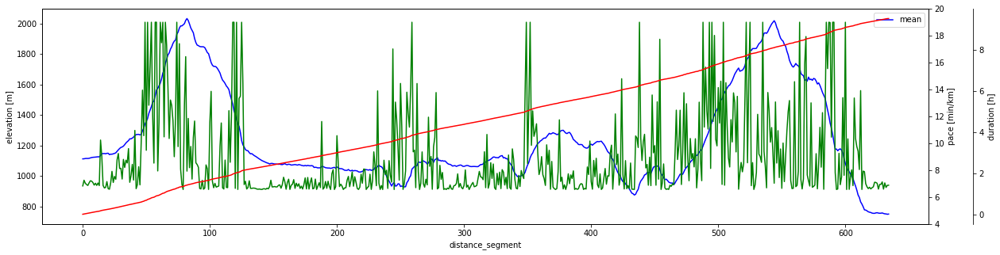

# Pacer Project

This repo provides a notebook to predict the pace for a given gps track based on a
base pace plus the uphill/downhill "penalties" from the base pace based on the
elevation per 100m. The pace prediction is based on a regression model which
is trained with a "reference run". The closer the reference run is to the 
predicted run (duration, elevation, technicality) the better the prediction.

This repo includes two of my longer reference runs (Wank and Osterfeldkopf) and
provides a prediction for the Zugspitz Ultratrail course. Of course you can replace 
the GPX files in `./data` with your own files and re-run the notebook.

In the distant future this may be implemented as an AWS Lambda function with
a nice UI. For now, the notebook is the UI.

A result will look like this:



## Run locally in Docker
You can simply build and run the container with
```
./build.sh
./run.sh
```

## Run remotely in My Binder
In case you have not Docker installed or want to try this from an iPad or another mobile device, 
you can also run the container in a remote web service called My Binder:
https://mybinder.org/v2/gh/okoeth/pacer-project/master

